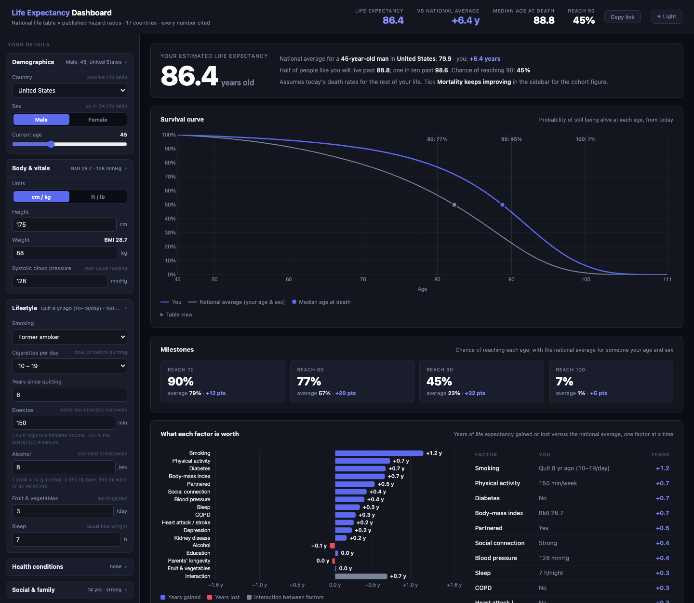

# Life Expectancy Dashboard

An actuarial life-expectancy estimate: start from your country's official life table, adjust it with 35 published hazard ratios for the risk factors with the strongest evidence, and read off your survival curve, the years each factor adds or costs, the chance of reaching 80 / 90 / 100, and what changing something would do — with every number cited.

Around that engine it is a small longevity planner: a health timeline of changes at the ages you would make them, a Longevity Score with alerts, blind spots and ranked levers, Plan A vs Plan B, a couple's joint survival, the age to plan retirement money to, and ways to share or save it all — in plain HTML and JavaScript, with nothing sent anywhere.



## What it models

- **17 national life tables, one source.** The UN's *World Population Prospects 2024* complete (single-year-of-age) tables for the US, UK, Canada, Australia, New Zealand, Ireland, Germany, France, Italy, Spain, the Netherlands, Switzerland, Sweden, Norway, Japan, Singapore and South Korea, by sex. The engine reproduces the UN's published life expectancy at birth for all 34 tables to within 0.02 years, which is asserted on every test run.
- **35 risk factors, each from a large cohort study or meta-analysis.** Lifestyle: smoking (intensity, years since quitting, cigar/pipe), exercise, strength training, sitting time, alcohol, sleep. Diet: fruit & vegetables, nuts, whole grains, processed meat, sugary drinks, coffee. Body: BMI, waist circumference, blood pressure, resting heart rate. Optional measurements: VO₂max, grip strength, hs-CRP. Conditions: diabetes / prediabetes, heart attack or stroke, atrial fibrillation, COPD, kidney disease, depression / serious mental illness, sleep apnoea, opioid or stimulant dependence, self-rated health. Social and environment: education, household income, employment, social connection, partnership, parents' longevity, air pollution. The hazard ratios and their sources are listed on the page itself, rendered from the same table the engine uses, so the documentation cannot drift from the code.
- **Every optional input is neutral until answered.** Measurements are judged against age- and sex-specific norms, so a blank field is exactly the population average and a value moves the estimate only by how far you sit from the norm. When VO₂max is entered, self-reported exercise counts at half weight — measured fitness is what it was standing in for.
- **Correlated factors are capped as groups**, so they cannot stack past what whole-pattern studies find: the five diet items at ±35 %, education + income at ±60 %, the fitness group at ±2.5×, BMI + waist at ±3×. The favourable side is soft: combined low-risk profiles have been studied to about half the average hazard, and below that each further halving counts half, with a hard floor at one-fifth; the adverse side keeps a 12× cap that multimorbidity data support to 8×. When either applies, the tornado's bars are computed without it and scaled to the headline so they still reconcile.
- **Re-anchored to the population average, not the study's reference group.** A published HR compares you with never-smokers or people of BMI 22.5–25; a national life table describes the *average* person, who is a mix. The multiplier actually applied is `HR ÷ Σ(prevalence × HR)`, so a person of exactly average risk reproduces the national table (asserted at every age) and a never-smoker correctly lands *above* the national average rather than at it. Smoking and BMI use each country's own WHO prevalence; disease prevalence and blood pressure are age-dependent.
- **Effects fade with age — except diseases.** Every source that stratifies by age finds relative risks shrinking in old age, so lifestyle, body and social factors fade from 60 (smoking from 75, where Thun et al. still find ≥ 3×). Diagnosed diabetes, heart disease, atrial fibrillation, COPD, kidney disease and drug dependence do not fade: their sources' life-expectancy figures imply a sustained hazard.
- **Living parents count for the ages they may still reach.** The evidence (Atkins 2016) is about the age a parent *attained*, so a parent who is alive is censored data. The select separates "still living" from "passed away", and a living parent is credited with the life-table expectation over the bands they can still reach — a mother alive at 75 will on average reach her mid-80s, so she is a mild advantage (HR ≈ 0.79), not a "70s" penalty. Grandparents are not modelled: there is no well-measured effect independent of the parents to cite.
- **Your future is not frozen at today.** A 40-year-old without diabetes is not a 40-year-old who will *never* have diabetes. The chance of developing each absent condition at the population rate is priced in, and blood pressure drifts upward with age at the median rate. Without this the estimate for a healthy young person ran three years too high.
- **Mortality improvement toggle.** Off, today's death rates hold for life — the "period" figure quoted in the news. On, each future year's rate falls at the pace the UN projects for that country, sex and age band over 2024–2073 — the "cohort" figure, roughly +4 years for a 30-year-old.
- **A health timeline.** Changes you plan, or things that might happen, go in at the age they happen: quit smoking at 50, reach 80 kg by 52, start exercising at 47, retire at 67, a diabetes diagnosis at 65. The engine asks for *you as you will be* at each future age, so an event changes the hazard from its age on and nothing else in the engine had to change; with no events, every result is identical to before, and that is asserted at every age. Quitting is modelled as it actually happens: the excess risk decays with a 7-year time constant from the quit age, so quitting at 45 is worth more than at 50, which is worth more than at 60. A weight target is reached in a straight line from today. A blood-pressure target is the reading *at that age*, and the usual drift with age continues from there. A dated diagnosis replaces the background chance of developing that condition (which the estimate already prices in) with certainty at that age, so the hazard is lower than average before it and higher after. Each event shows its own effect, the headline includes them all, and a dashed *if nothing changes* line on the survival curve shows what the plan is worth. The fourteen one-click *quick changes* are timeline events dated today; each is asserted to give exactly the same survival curve as editing the input directly.
- **Per-factor tornado chart** — years gained or lost versus the national average, one factor at a time, with an explicit *interaction* bar so the chart always reconciles to the headline figure. Gains are blue and losses red, not green and red: the green/red pair failed the colour-blind separation check (deutan ΔE 4.0), blue/red passes at 24.
- **A Longevity Score, read straight off the tornado.** 50 is exactly the national average for your age, sex and country, and each year above or below it is 5 points (clamped to 0–100). Five pillars (Habits, Fitness, Body, Health, Life & family) are the tornado's rows summed by factor group, so the pillars plus the interaction bar *are* the score; the printed whole-point terms use largest-remainder rounding so they always add up to the number shown. A two-to-four-sentence *bottom line* names your biggest drag, biggest lever and biggest unknown.
- **Alerts and blind spots.** Alerts are the factors costing you 0.3 years or more versus the average (worst first, with a line on what moves each), plus model notes: prediabetes, timeline changes that do nothing, the cap and the soft floor. Blind spots are the optional inputs you left blank, ranked by how far a typical good versus a typical poor answer would move your estimate — VO₂max is usually first, and a watch's estimate is good enough.
- **Biggest levers.** Every quick change not already on your timeline, ranked by the years it adds on its own, with a running *together* column that shows the diminishing returns of stacking them.
- **100 lifetimes like yours.** One dot per person, shaded by decade of death. Dot *i* is the (*i* + ½)th percentile of your survival curve — an exact reading, not a random draw — so the picture is stable and matches the curve (asserted: the count reaching 90 is within one of 100 × S(90)). The ordinal colour ramp is one hue, checked with the dataviz palette validator against each theme's surface.
- **Tabs.** Overview · Factors · Timeline · Compare · Lifespan · Methodology; the tab is part of the link, so a link can open on the timeline.
- **Plan your money to an age.** Money planned to your life expectancy runs out for about half of people like you, so the Tools tab gives the ages with a 1-in-10 and 1-in-20 chance of outliving them (the 90th and 95th percentiles of age at death), and the same for the last survivor of a couple, with a copy button for the FIRE dashboard's planning-horizon field.
- **You and a partner: two linked lives.** The partner is the average partnered person of an age and sex in your country, someone you describe (body, blood pressure, smoking, exercise, alcohol, sleep, diabetes, heart attack or stroke, AF), or one of your saved plans. While both are alive each has their own death rate, counted as partnered; after one dies, the survivor's rate rises by the **widowhood effect** for their sex — ×1.22 for men, ×1.03 for women ([Moon et al. 2011](https://pmc.ncbi.nlm.nih.gov/articles/PMC3157386/), a meta-analysis of 15 cohorts) — and more in the first year (1.41 within six months vs 1.14 after, so ×1.14 on top). It does not reuse the model's 1.24 for being unpartnered, which pools never-married and divorced people. The panel shows who is likely to outlive whom, the years you can expect together and on your own, the age you would most likely be if you are the one left, when only one of you is likely still alive, what the widowhood effect costs each of you, a stacked *who is still here* chart, and — given the year you got together — the chance you both reach each coming anniversary. A toggle switches to independent lives for comparison. Asserted: the states add up every year, who outlives whom adds up to 1, years together + years alone = your life expectancy in the couple, switching the effect off reproduces two independent lives exactly, and with a partner of 110 (certain to die this year) the survivor's next years follow their own death rates raised by exactly the first-year and later factors — on both sides of the couple. The partner, the toggle and the year travel in the link.
- **Your life in weeks.** 5,200 squares from birth to 100: weeks lived, and weeks ahead shaded by the chance of being alive to see them. The expected weeks ahead are asserted to match life expectancy.
- **Share & save.** A 1200 × 630 image drawn in the page, a Markdown or plain-text summary (with an option to leave out age and measurements), a prompt that asks an AI assistant to sanity-check the inputs and name what the model leaves out, and a JSON file holding the same string as the link, so an imported file goes through the link's validation.
- **Four themes.** Dark, Light, Paper and Ocean. The new two only change surfaces and text; every chart colour was re-validated on each theme's surface. The couple chart's third line is aqua: green against Plan B's orange failed colour-blind separation (ΔE 3.7–4.5), aqua passes (9.2–9.4), and in the light themes, where it is under 3:1 contrast, it is dashed and has a table view.
- **Plan A vs Plan B.** *Start comparing* copies your plan into Plan B and switches the sidebar to it, so Plan A stays put. A switch at the top of the sidebar picks which plan you are editing, and every tab shows that one. The Compare tab has a scorecard (A, B, B − A), both survival curves (Plan B in orange, checked against the indigo with the dataviz palette validator, colour-blind separation ΔE ≈ 30), and a table of exactly what differs, inputs and timeline, each with *use A*. Swap, reset B to A, keep A or keep B. The page only ever edits one plan; the other waits beside it, so nothing outside `js/compare.js` knows comparing exists. A link carries both plans: B is written as its differences from A (a blank in B that A filled is written as an empty value, so it survives).
- **Saved plans.** Name and save a plan in this browser, load it into whichever plan you are editing. Saved plans are stored as the same compact string as the link and loaded through the link's validation; corrupt or blocked storage reads as no saved plans and never breaks the page.
- **Quick start, examples and a tour.** Four short steps (basics, body, habits, health and people) fill in a plan; a blank blood pressure becomes the typical reading for your age rather than a flattering 120. Seven example people (a desk worker, a smoker with a plan to quit, an endurance athlete, a 62-year-old with type 2 diabetes …) keep your country and units. A six-step tour spotlights each part of the page. On a first visit with no link, Quick Start opens once.
- **Age-at-death distribution**, milestone tiles, table twins for every chart, dark/light theme, shareable URL hash, CSV and PNG export. No framework, no server, nothing leaves the page.

## Try it

Open `index.html` directly in a browser — no build step, no server, no dependencies beyond Chart.js (CDN, pinned with an SRI hash and a graceful fallback if it is blocked). Everything recalculates as you type.

## Using the dashboard

1. **Start with Quick start** (it opens on a first visit, and from the tab bar any time): four short steps, or one of seven example people. Or go straight to the sidebar — country, sex, age, height, weight, blood pressure and the Lifestyle group have the largest effects and the only concrete defaults; everything else starts as "not entered", which means the population average.
2. **Fill in what you know.** Waist, resting heart rate, VO₂max (a fitness watch's estimate is fine), grip strength and hs-CRP are optional and judged against people of your age and sex, so a blank field costs nothing and a value only moves the estimate by how far you sit from the norm. *Factors → Worth finding out* ranks the blanks by how much answering them could move your estimate.
3. **Overview.** Your life expectancy (the *mean* age at death for people like you) beside the national average, the Longevity Score and its pillars, a bottom line, the survival curve and the milestones.
4. **Factors.** Alerts, blind spots, and *What each factor is worth*: every answer ranked by the years it adds or costs.
5. **Timeline.** The biggest levers, ranked; add one, then move it to the age you would actually do it. Each row shows that change alone; the total compares your plan with nothing changing.
6. **Compare.** Copy your plan into Plan B, change anything, and read the scorecard and both curves. Save plans in the browser to come back to.
7. **Lifespan.** 100 lifetimes like yours, and the spread of age at death.
8. **Tools.** The age to plan retirement money to, you and a partner, your life in weeks, and *Share & save*: an image, a text summary (optionally without your age and measurements), a prompt to ask an AI to check your inputs, and a JSON file.
9. **Toggle the projection.** *Mortality keeps improving* switches from today's death rates (the "period" figure quoted in the news) to the UN's projected improvement (the "cohort" figure, typically a few years higher for younger adults).

*Copy link* puts everything in the URL — inputs, timeline, both plans when comparing, the partner, the tab. Nothing you enter leaves the page. The Methodology tab explains every rule, lists every hazard ratio with a link to its source, and shows the calibration checks computed live.

## Deploying

The site is static. To publish on GitHub Pages: create a repository, push this folder (`git remote add origin <url> && git push -u origin main`), then in the repository's *Settings → Pages* choose *Deploy from a branch*, branch `main`, folder `/ (root)`. The `.nojekyll` file is already there. The `og:image` tag in `index.html` points at `https://deet88.github.io/Life-Expectancy/screenshot.png` — change it if the repository is named differently.

## Calibration

The pipeline is checked against life-expectancy differences that the source papers report directly, computed live on the page and asserted by the harness:

| Check | Published | This engine |
|---|---|---|
| Current smoker vs never, US man aged 35 | ≈ 10 years (Jha 2013) | 11.0 |
| BMI 32 vs 23, aged 40 | 2–4 years (PSC 2009) | 2.8 |
| BMI 42 vs 23, aged 40 | 8–10 years (PSC 2009) | 8.6 |
| > 25 drinks/week vs ≤ 7, aged 40 | 4–5 years (Wood 2018) | 4.4 |
| Five low-risk habits vs none, US man aged 50 | 12.2 years (Li 2018) | 11.8 |
| Life expectancy, US man at 50 with all five low-risk habits | 87.6 (Li 2018) | 86.6 |
| Life expectancy, US man at 50 with none of them | 75.5 (Li 2018) | 74.2 |
| Diabetes + heart attack, aged 60 | 12 years (Di Angelantonio 2015) | 9.3 |

Two are worth a note. The alcohol HRs are *back-solved* so the engine reproduces Wood et al.'s reported losses, and the page says so. The multimorbidity figure is below the paper's because the paper's reference cohort had a lower death rate than the US table (a constant 3.7× on the actual table gives 10.2) and because the engine prices in that the healthy comparator may develop disease later; the acceptance band is 8–15 and the reasoning is on the page. Every check holds the factors it does not vary at the population average, which is what the papers compare.

## Data

`tools/build_lifetables.py` streams the UN's two projection files (~200 MB gzipped each, never written to disk), keeps the 17 countries, and writes `tools/lifetables.json` (34 KB), which is committed and injected into `data/lifetables.js` between the `LIFETABLES:BEGIN / END` markers. Re-inject without downloading: `python3 tools/build_lifetables.py --inject`.

**The baseline is the UN's 2024 table, not its 2023 estimate.** The WPP 2024 single-year *estimates* for 2022–23 carry artifacts for some countries — Australia's male death rates at ages 21–38 are recorded at ~0.00001, fifty times too low, with a spurious bump at 60–63 — and raw sampling noise for small ones (Norway's female rates jump ±40% between adjacent years). The first projected year comes from the UN's smooth mortality model, is consistent across countries, agrees with the 2023 estimate on life expectancy at birth to within 0.2 years, and is one year closer to today. The build script asserts that adult mortality rises over every 5-year span, which the 2023 tables fail.

Prevalence of smoking, obesity, overweight and underweight by country: WHO Global Health Observatory, 2022, age-standardised (`M_Est_smk_curr_std`, `NCD_BMI_30A`, `NCD_BMI_25A`, `NCD_BMI_18A`).

## Verifying changes

```sh
osascript -l JavaScript verify.js
```

3,791 assertions covering the life-table data, the Gompertz tail extension, the factor table (every factor cited, every prevalence summing to 1), the re-anchoring invariant at every age, the direction of every factor in five profiles, the age-fade rules, the group caps, the soft floor and 12× cap, the neutrality of every not-entered input, the calibration checks above, the tornado's reconciliation, the health timeline (no events = no change at every age; a change dated today = editing the input; quit, weight, blood-pressure and diagnosis semantics; the tornado still reconciling with events; the panel's add / edit / remove handlers; the factor table tagging exactly the factors the timeline changes), the Longevity Score (50 + 5 × years, pillars reconciling, printed terms summing), the levers' ranking and running total, the blind spots, the alerts, the 100 lifetimes against the survival curve, the tab in the link, Plan A vs Plan B (editing B never touches A, swap twice is the identity, the diff and its resets, keep A / keep B, both plans through the link including blanks), saved plans (round trip, corrupt and blocked storage, validation on load), every example profile (in range, valid choices, keeps country and units), Quick Start (junk answers rejected, blank blood pressure), every tour step pointing at something on the page, the couple maths, the plan-to ages, life in weeks, the share summary's privacy option, the AI prompt, JSON import (other files, other versions, hostile links, an empty plan), the partner in the link (described partners, the widowhood toggle, the year you got together, hostile values), the linked couple model, and the four themes, hash round-tripping (including hostile links, timeline events, and old what-if links, which become changes dated today), the real input handlers (metric/imperial conversion), CSV/PNG export, the theme, and that every panel actually rendered. It reads the `<script src>` list out of `index.html` and evaluates those files, in page order, under stub DOM objects, so the tests exercise the shipped code and cannot drift from it. There is no Node on the machine this was built on, hence `osascript`.

Every assertion class was mutation-tested: the code was deliberately broken twenty ways in a scratch copy (normalisation dropped, cap removed, improvement toggle ignored, hash key missing or colliding, smoking fade moved, tail extension flattened, imperial weight unconverted, BMI target wrong, blood-pressure drift removed, interaction bar dropped, a function smuggled into chart-plugin options, not-entered inputs made non-neutral, group caps ignored, the fitness overlap rule dropped, the soft floor removed, unemployment counted past 65, prediabetes frozen) and the harness caught each one. Two lessons are baked into it. A missing hash key serialised as the literal string `"undefined"` and round-tripped anyway, so the harness checks the key map itself. And Chart.js treats any *function* inside plugin options as a scriptable option and calls it — a `format` callback came back as a string, the plugin threw inside `new Chart()`, and every panel after the tornado silently went blank; only the screenshot pass caught it. The stub `Chart` now runs the page's plugin hooks and the harness asserts plugin options carry no functions and that every panel rendered. The timeline added fourteen more (engine ignoring the timeline, quitting reset to day one, a diagnosis double-counting the background onset, prediabetes progressing past a dated diagnosis, blood-pressure drift re-based to today, weight jumping instead of ramping, past-dated events not moved to today, booleans mis-encoded in links, old what-if links dropped, events unsorted, a blank field read as zero, reset keeping the timeline, no event cap) and the harness caught each one; the first run missed the double-counted onset because the check said "no higher" rather than "strictly lower", and the blank-field case was a real bug the hostile-link test found before it shipped. Phase 2 added ten more (a pillar missing a factor group, score terms rounded one by one so the printed sum is off by one, no clamp, lifetimes read at 1 %, 2 % … instead of midpoints, levers re-offering timeline changes or sorted backwards or with a wrong running total, blind spots listing answered inputs, alerts flagging trivial effects, an unknown tab accepted from a link), all caught; the midpoint one needed a new check (nobody in the 100 dies today) before it was. Phase 3 added sixteen (Plan B sharing Plan A's objects, switching forgetting the timeline, swap doing nothing, a blank in B dropped from or misread in the link, B decoded against the defaults instead of A, an old comparison surviving a new link, keep ignoring which plan, reset missing a case or accepting unknown inputs, saved plans not shape-checked or throwing on blocked storage or skipping validation, a blank blood pressure becoming 120, examples overwriting your country, reset keeping the comparison), all caught. Phase 4 added seventeen (at least one or both computed as a max or min, the last-survivor reading not interpolated, the average partner given your risk model, the 1-in-20 age reading 1 in 10, past weeks uncertain, weeks skipped in the drawing, the private summary keeping your age, the AI prompt dropping the timeline, JSON import ignoring the version or keeping the old plan for an empty file, a partner from a link unvalidated or kept across links, an unknown theme accepted, a theme throwing on blocked storage, the first-paint script trusting any stored theme, and the bottom line lower-casing "BMI"), all caught. One test written in this phase could never fail (it ended in `|| true`); it was found on review and deleted. The linked couple model added twelve more (widowhood never applied, the first-year spike dropped or lasting forever, both survivors given the men's figure, simultaneous deaths ignored, your unpartnered answer kept in the couple, the average partner taken as the default profile, described answers ignored, past anniversaries shown, the year together unchecked, a described partner keeping stray keys, the toggle lost from the link). One was missed at first — the partner's own sex-specific figure was only checked from your side — and a mirror-image test now catches it.

## Notes

- Vanilla HTML/CSS/JS with Chart.js for the visualisations. No framework, no bundler, no backend.
- Layout: `index.html` (markup), `css/app.css`, `data/lifetables.js` (generated), and `js/engine.js` (factors and the actuarial engine — pure, no DOM), `js/timeline.js` (health-timeline events — pure, no DOM), `js/insights.js` (score, alerts, blind spots, levers, lifetimes — pure, no DOM), `js/compare.js` (Plan A / B and saved plans — no DOM), `js/onboarding.js` (examples, Quick Start, tour steps — no DOM), `js/tools.js` (couple, plan-to age, life in weeks — pure), `js/share.js` (summary, AI prompt, JSON — no DOM), `js/state.js` (inputs, defaults, the shareable hash), `js/ui.js`, `js/ui-compare.js`, `js/ui-onboarding.js`, `js/ui-tools.js` (rendering), `js/main.js` (refresh and start-up). They are plain scripts, not ES modules, because browsers refuse modules on `file://` and the page must keep working when opened by double-click.
- The combined hazard multiplier is capped at 12×. The proportional-hazards assumption has been tested to about 8× (three cardiometabolic diseases together, Di Angelantonio 2015); stacking fifteen adverse factors multiplicatively gave a 40-year-old a life expectancy of 41 before the cap, which no evidence supports. A profile that hits the cap is told so on the page.
- Most hazard ratios come from North American and European cohorts and are applied unchanged to every country; only the baseline table and the smoking/BMI prevalences are country-specific.
- Not medical advice. This is the average outcome for a large group of people who share your answers — individual outcomes vary enormously, and the estimate is only as honest as the inputs.
